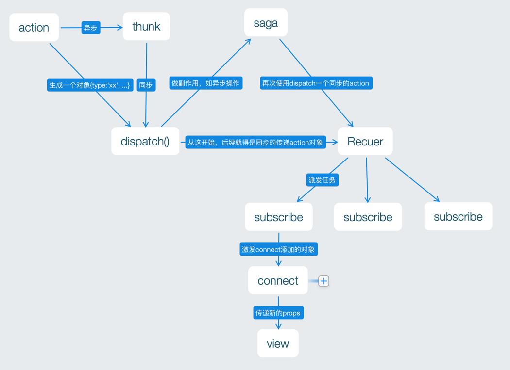

# 仅仅是一个使用 redux-saga 的demo

使用了：
- redux
- redux-saga: 把副作用抽离成独立的 Generator 函数，执行完副作用的事件，再dispatch普通的action去修改state
- redux-action: action映射reducer, 简化action和reducer的编写
- redux-auto-local-storage: 自动持久化某些store.getState()的keys, 兼容immutable对象
- immutable: 不可变对象

## redux-thunk 和 redux-saga 的区别

